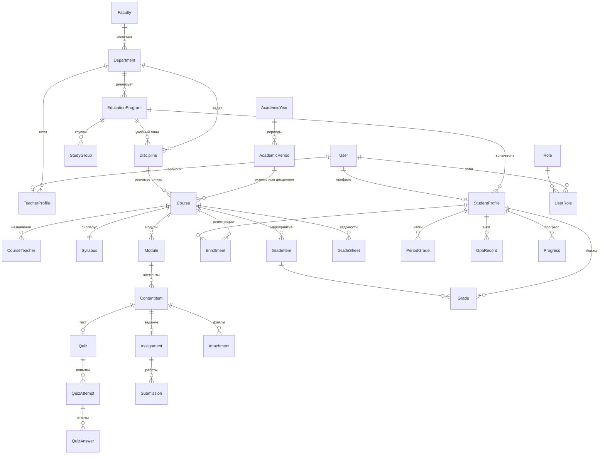

# Приложение А. Схема базы данных

СУБД — PostgreSQL 16 (Supabase). Полное определение — `prisma/schema.prisma`.

---

## Общая структура



---

## 1. Организационная структура

| Модель | Назначение | Ключевые поля |
|---|---|---|
| `Faculty` | Факультет или школа | `code`, наименования на трёх языках |
| `Department` | Кафедра | `facultyId`, `code` |
| `EducationProgram` | Образовательная программа | `code` по классификатору, `level`, `language`, `durationYears`, `totalCredits` |
| `AcademicYear` | Учебный год | `name` вида «2026-2027», `isCurrent` |
| `AcademicPeriod` | Академический период | Даты обучения, регистрации и сессии; `status`, `isCurrent` |

Академический период — центральная сущность планирования: к нему привязаны
курсы и итоговые оценки. Уникальность — по паре (учебный год, порядковый номер).

---

## 2. Люди

| Модель | Назначение | Особенности |
|---|---|---|
| `User` | Учётная запись | ИИН зашифрован (`iinEncrypted`) + детерминированный `iinHash` для поиска; ФИО на трёх языках; счётчик неудачных входов и блокировка |
| `Role`, `UserRole` | Роли | Девять ролей раздела 3 ТЗ; роль может иметь срок действия |
| `StudentProfile` | Профиль обучающегося | Программа, группа, курс, форма и язык обучения, статус, `platonusId` |
| `TeacherProfile` | Профиль преподавателя | Кафедра, должность, учёная степень, `platonusId` |
| `StudyGroup` | Академическая группа | Уникальна в пределах программы |

**Шифрование ИИН.** Значение хранится в виде `base64(iv):base64(tag):base64(ciphertext)`
(AES-256-GCM). Рядом — HMAC-SHA256 того же значения: он позволяет искать
пользователя по ИИН и контролировать уникальность, не расшифровывая данные.
Ключ — переменная окружения `IIN_ENCRYPTION_KEY`, при её утрате данные
не восстанавливаются.

---

## 3. Учебный процесс

### `Discipline` — дисциплина учебного плана

Содержит `credits`, `cycle` (ООД/БД/ПД), `component` (ОК/ВК/КВ), язык,
профиль оценивания и результаты обучения на трёх языках.

**Содержимым не наполняется** — это описание учебного плана.

### `Course` — экземпляр дисциплины в периоде

**Именно `Course` наполняется содержимым.** Уникален по тройке
(дисциплина, период, поток): одна дисциплина может читаться несколькими
потоками в одном периоде.

Жизненный цикл `status`: `DRAFT` → `ON_REVIEW` → `APPROVED` / `REJECTED` →
`PUBLISHED` → `ARCHIVED`.

Флаг `isPublic` управляет отображением в публичном каталоге отдельно
от публикации курса для зачисленных студентов (F-P-04).

### `CourseTeacher` — назначение на курс

Ключевая таблица разграничения доступа: **наличие роли «Преподаватель»
не даёт доступа ни к одному курсу без записи здесь.** Флаги `isLead`
(ведущий преподаватель) и `isAssistant` (тьютор без права публикации).

### `DisciplineLink` — пререквизиты и постреквизиты

Ребро графа зависимостей между дисциплинами.

### `WorkTypeNorm` — норматив по видам работы

Доля каждого вида учебной работы в общем объёме дисциплины с допуском
отклонения. Проверяется при публикации, если включена соответствующая настройка.

---

## 4. Содержание курса

| Модель | Назначение |
|---|---|
| `Module` | Раздел курса; обычно соответствует учебной неделе |
| `ContentItem` | Единица содержания — шесть типов |
| `Attachment` | Файл в Supabase Storage: ключ, бакет, размер, MIME, контрольная сумма |

**`ContentItem.plannedAcademicHours`** — обязательное поле. Сумма по всем
элементам курса должна равняться `credits × 30`; проверка выполняется
при публикации и блокирует её при несоответствии.

**`ContentItem.workType`** — лекция, практическое занятие, лабораторное занятие,
СРОП или СРО.

Уникальность `orderIndex` в пределах модуля обеспечивает предсказуемый порядок;
при перетаскивании индексы пересчитываются через временный отрицательный сдвиг,
чтобы не нарушить ограничение уникальности.

---

## 5. Оценивание

### Справочник шкалы

`GradeScale` + `GradeScaleItem` — Приложение 1 к Типовым правилам
и Приложение 2 (языковые дисциплины с уровнями ОЕК). Загружается сидом,
пользователями не редактируется.

### Параметры расчёта

`GradeConfig` — коэффициенты формулы, порог допуска, число периодов контроля.
Наследование: настройки вуза (`SystemSetting`) → уровень дисциплины →
уровень курса. Более частная настройка перекрывает общую.

### Оценки

| Модель | Назначение |
|---|---|
| `GradeItem` | Оценочное мероприятие: период контроля, максимальный балл, вес; может быть привязано к тесту или заданию |
| `Grade` | Балл студента за мероприятие; кто и когда выставил |
| `PeriodGrade` | Итоги по курсу: РК1, РК2, рейтинг допуска, экзамен, итоговый балл, буквенная оценка, эквивалент |
| `GradeSheet` | Ведомость: статус, кем и когда закрыта, основание переоткрытия |
| `GpaRecord` | GPA за период, год и накопительный |

`PeriodGrade` пересчитывается автоматически при любом изменении балла;
`GpaRecord` — вслед за ним.

`GradeSheet.status = CLOSED` блокирует правку оценок; переоткрытие возможно
только офисом регистратора с указанием основания.

---

## 6. Тесты и задания

| Модель | Назначение |
|---|---|
| `QuestionBank`, `QuestionTopic` | Банк вопросов курса, темы для отбора |
| `Question`, `AnswerOption` | Вопрос и варианты; для короткого ответа допустимые ответы хранятся в `payload` |
| `Quiz`, `QuizQuestion` | Тест и его состав |
| `QuizAttempt` | Попытка: статус, время начала и истечения, результат, **`questionOrder`** |
| `QuizAnswer` | Ответ на вопрос в попытке |
| `Assignment` | Задание: срок, форматы, штраф за просрочку |
| `Submission` | Сданная работа: статус, просрочка, балл до и после штрафа, отзыв |

**`QuizAttempt.questionOrder`** хранит порядок вопросов и вариантов ответа
для конкретной попытки. Это то, что обеспечивает сохранение состояния
при обрыве связи: студент возвращается к той же последовательности.

**`Submission.rawScore` и `Submission.score`** разделены намеренно: преподаватель
ставит балл за содержание работы (`rawScore`), система применяет штраф
за просрочку и записывает результат в `score`.

---

## 7. Учёт активности

| Модель | Назначение |
|---|---|
| `ActivityLog` | Событие: вход, просмотр, завершение, отправка теста, загрузка файла |
| `TimeSession` | Сессия работы с элементом: начало, последний сигнал, засчитанные минуты, просмотренная доля видео |
| `ItemCompletion` | Отметка о завершении элемента: способ засчитывания и освоенные часы |
| `Progress` | Агрегат по курсу: завершено элементов, освоено часов, процент, время в системе |

`TimeSession.countedMinutes` — не астрономическое время, а сумма засчитанных
интервалов: перерывы дольше порога неактивности не учитываются, и итог
ограничен 150 % плановой трудоёмкости элемента.

`Progress` — денормализованный агрегат: он пересчитывается при каждом изменении
завершённости, но избавляет от тяжёлых запросов при выводе списка дисциплин
и отчётов, что существенно на бесплатном тарифе с лимитом трафика БД.

---

## 8. Интеграция и служебные модели

| Модель | Назначение |
|---|---|
| `IntegrationOutbox` | Очередь исходящих событий: тип, полезная нагрузка, статус, попытки, `idempotencyKey`, признак необходимости подтверждения |
| `IntegrationMapping` | Соответствие внутренних идентификаторов внешним (Platonus) |
| `AuditLog` | Журнал аудита: кто, что, когда, прежнее и новое значение, основание, IP |
| `Consent` | Согласие на обработку ПДн: версия документа, дата, IP, дата отзыва |
| `Notification` | Уведомления пользователю |
| `Announcement` | Объявление по курсу |
| `SystemSetting` | Настройки системы: ключ, значение, тип, категория |

`IntegrationOutbox.idempotencyKey` — уникальный индекс: повторная постановка
того же события в очередь не создаёт дубликата. `requiresApproval` вместе
с `approvedById` реализует требование раздела 9.1 о ручном подтверждении
передачи итоговых оценок.

Служебные модели Auth.js: `Account`, `Session`, `VerificationToken`.

---

## 9. Индексы

Расставлены по фактическим сценариям запросов:

- `courses (status, isPublic)` — публичный каталог;
- `enrollments (studentId)` — список дисциплин обучающегося;
- `course_teachers (teacherId)` — список курсов преподавателя;
- `grades (studentId)`, `period_grades (studentId, periodId)` — журнал и GPA;
- `activity_logs (userId, createdAt)`, `(courseId, createdAt)` — отчёты об активности;
- `time_sessions (userId, contentItemId)`, `(isClosed)` — учёт времени и закрытие
  повисших сессий;
- `integration_outbox (status, nextAttemptAt)` — выборка очереди на отправку;
- `audit_logs (actorId, createdAt)`, `(entityType, entityId)`, `(createdAt)` — фильтры
  журнала аудита.

---

## 10. Стратегия удаления

| Связь | Поведение | Обоснование |
|---|---|---|
| `Course → Discipline`, `Course → AcademicPeriod` | `Restrict` | Дисциплину или период с курсами удалить нельзя |
| `Module → Course`, `ContentItem → Module` | `Cascade` | Содержание не существует без курса |
| `Grade → GradeItem`, `Grade → StudentProfile` | `Cascade` | Балл не существует без мероприятия и студента |
| `Grade → User (gradedBy)` | `SetNull` | Удаление учётной записи преподавателя не должно удалять выставленные им оценки |
| `AuditLog → User` | `SetNull` | Запись аудита сохраняется даже после удаления пользователя |
| `StudentProfile → StudyGroup` | `SetNull` | Расформирование группы не удаляет студентов |

Отчисленные обучающиеся не удаляются: у них меняется `StudentProfile.status`.
Регистрации на курсы отменяются проставлением `Enrollment.cancelledAt`,
а не удалением записи — это сохраняет историю.

---

## 11. Миграции

Первая миграция создаётся локально:

```bash
npx prisma migrate dev --name init
```

Каталог `prisma/migrations/` коммитится в репозиторий. На Vercel применяется
`prisma migrate deploy` — команда исполняет готовые миграции и никогда
не изменяет схему самостоятельно.

Подключение приложения идёт через транзакционный пул Supabase (порт 6543,
`pgbouncer=true&connection_limit=1`), создание схемы и миграции — через
session pooler (порт 5432, `DIRECT_URL`). Разделение обязательно: пул
в режиме транзакций не поддерживает подготовленные выражения, которые
использует миграционный движок.

Direct connection (`db.xxxxx.supabase.co`) для `DIRECT_URL` не подходит:
без платного IPv4-адреса он доступен только по IPv6.
